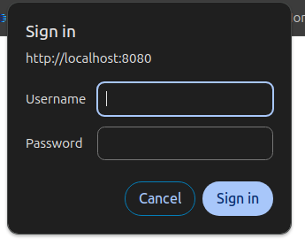
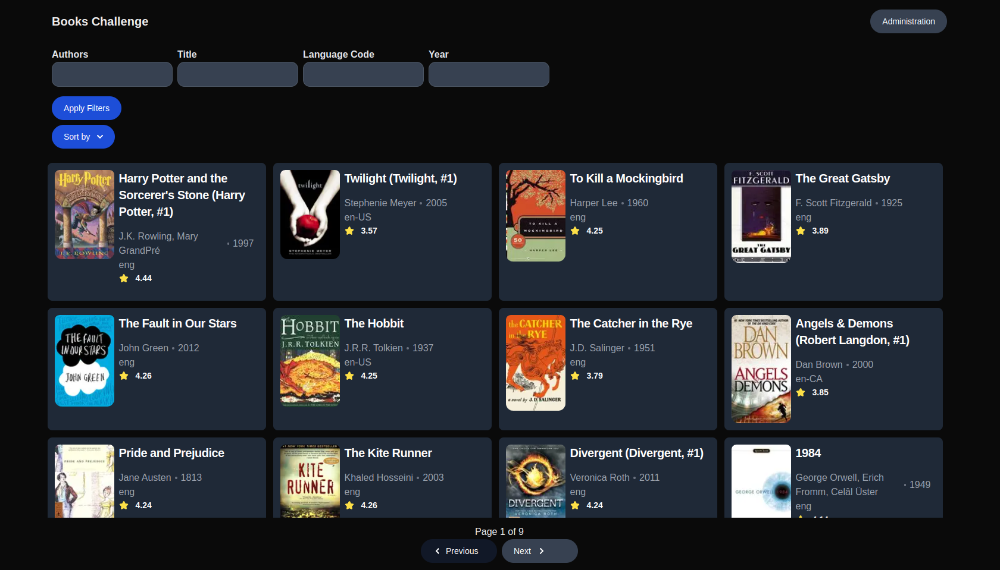
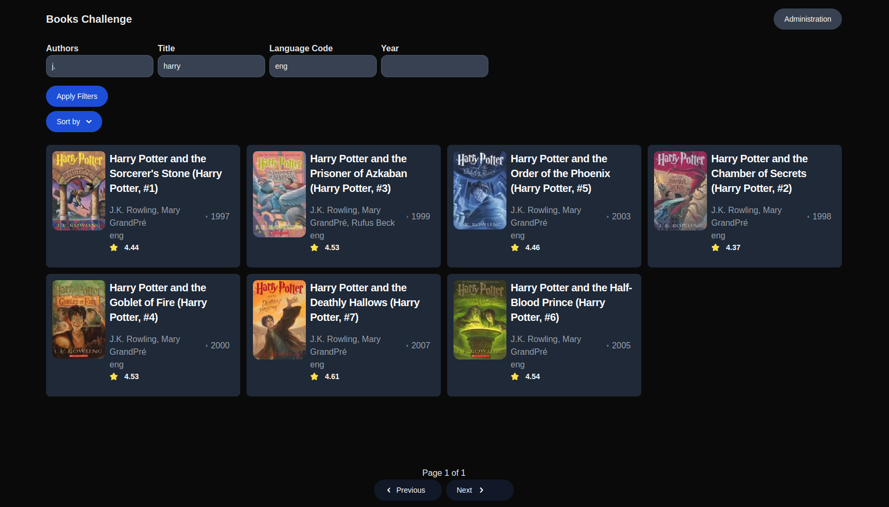
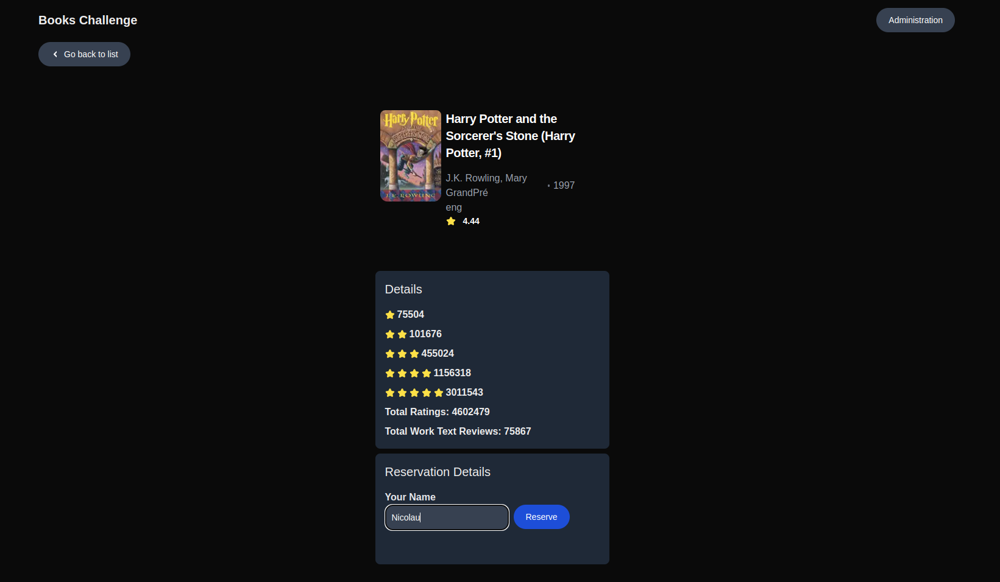
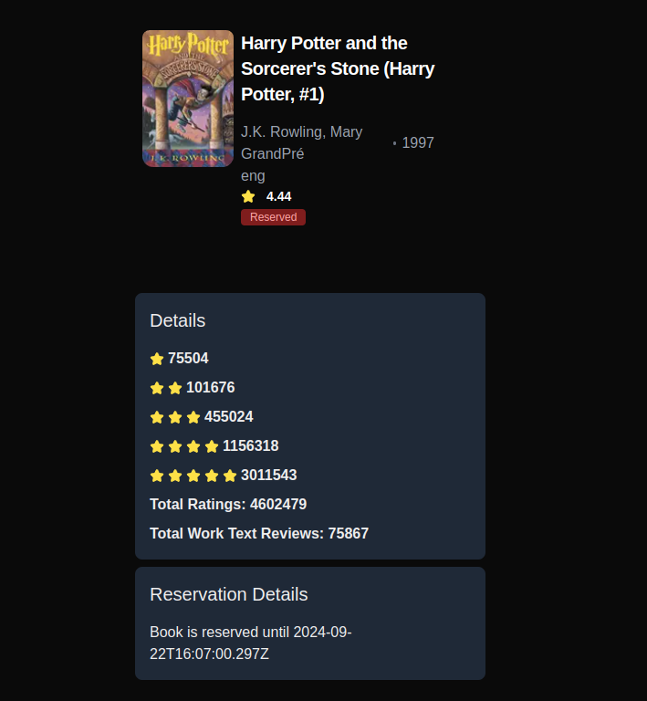
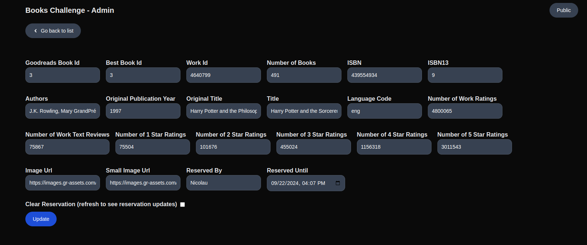

# Books Challenge - Server
# Technologies used
- Node.js
- Typescript
- React
- Next.js
- Tailwind

# Design choices

## Assumptions

- Focus was not on beauty but on usability of the user interface.

## Project Structure

The project structure follows the structure recommended in the Next.js App Router documentation, with additional folders for API server client, UI components and other things like Typescript types.

## Authentication

Authentication is done using BASIC authentication. This authentication is controlled in the frontend by sending a 'WWW-Authenticate' header if the user accesses any page prefixed with `/admin`. The middleware then confirms with the server that the user credentials are correct. The credentials provided are then used for endpoints that require authentication on the server.

## Pages

### Public Book List

The search and sort filters and the pagination links apply query params to the url that in turn convert to query params when querying the backend itself. Title and Author filters partially match results.

`http://localhost:8080/?title=harry&authors=j.&languageCode=eng&pageSize=12&sort=averageRating%2BASC`

### Public Book Detail

Detail page shows more book details than the ones present on the list and allow a user to reserve a book. The reservation time is 15 minutes and is set on the backend, After this time the book becomes available to be reserved again.

### Admin Book List

The admin book list page was duplicated from the public page. One addition this page has is the upload feature.

### Admin Book Detail

TODO etags 
TODO reservations

## Improvements

improvements can be made to the current implementation, with the most relevant being.

- Better error handling - Returning more specific errors to the user.
- Better data validation - More granular validation, for example, enforce that rating must be a number between 1 and 5.
- Change admin list page to a more appropriate administration layout. For example, present the books as a table instead of cards. 
- Improve admin update form and add preview.